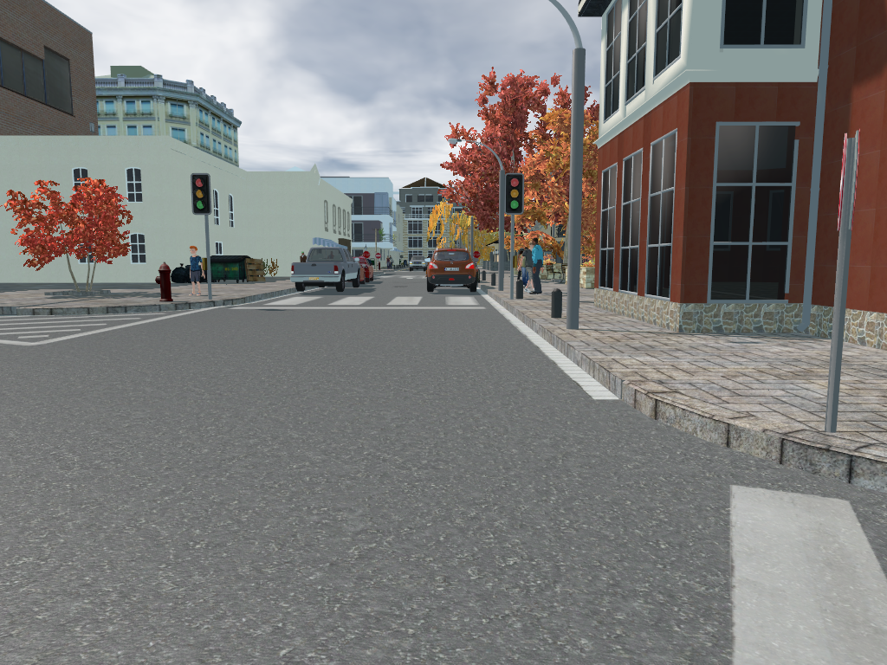
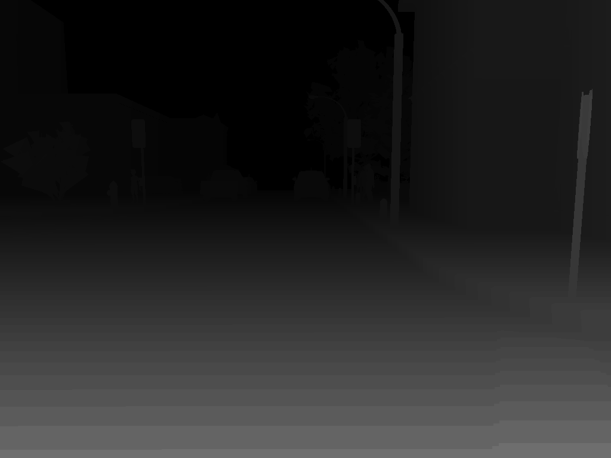
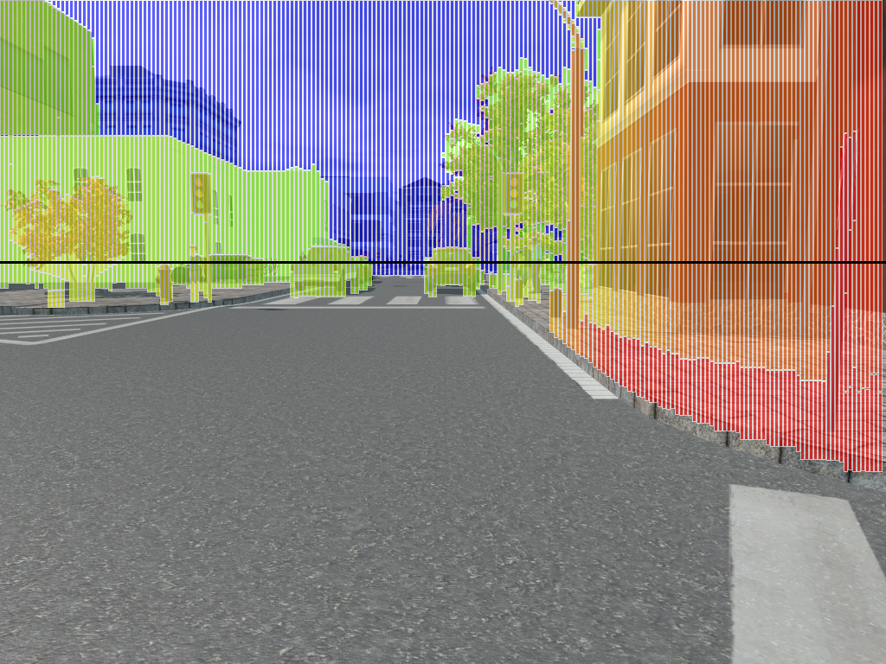

# GPU-accelerated real-time stixel computation

This is the implementation of [GPU-accelerated real-time stixel computation](https://arxiv.org/abs/1610.04124), [D. Hernandez-Juarez](http://www.cvc.uab.es/people/dhernandez/) et al.

Performance obtained measured in Frames Per Second (FPS):

|                 | 1280 x 240    |   640 x 480   |   1280 x 480    |
| -------------   |:-------------:|:-------------:|:---------------:|
| NVIDIA Tegra X1 | 86.8          |    45.7       |     22.3        |
| NVIDIA Titan X  | 1000          |     581       |     373         |

Results for example image (Input and Disparity):




Results for example image (Output):



## How to compile and test

Simply use CMake and target the output directory as "build". In command line this would be (from the project root folder):

```
mkdir build
cd build
cmake ..
make
```

## How to use it

Type: `./stixels dir max_disparity`

The argument `max_disparity` is the maximum disparity of the given disparity images, there are lots of parameters you can set in "main.cu".

`dir` is the name of the directory which needs this format:

```
dir
---- left (images taken from the left camera)
---- right (right camera)
---- disparities (disparity maps)
---- stixels (results will be here)
```

An example is provided, to run it type: `./stixels ./example 128`

## Important Parameters

In order to make this code work for your images you should set the following parameters.

Command line parameter:
- Disparity: Maximum disparity of the disparity map, this depends on the stereo-pair cameras

Other parameters (main.cu):
- Focal: Depends on the cameras you are using (in pixels)
- Baseline: Depends on the cameras you are using (in meters)
- Camera Center Y: Depends on the cameras you are using (in pixels)
- Column Step: This is the width of the stixels, depends on what you want to do with stixels afterwards (in pixels)

## How to generate the output image

The output .stixel file has the following format:

```
1,612,767,6.92;2,611,314,15.34; .... # Column 0 (starting from left)
2,758,767,0.08;2,757,300,11.34; .... # Column 1
...
```

Each line is a different column, and each stixel is separated by ";". The stixel format is:

Type (ground=0, object=1, sky=2), starting_row, end_row, mean_disparity

Also, for convinience, the actual rows are rows-1-given_row.

In order to generate an image for this format, use [this](https://github.com/dhernandez0/show_stixels/)

## Related Publications

[Embedded real-time stereo estimation via Semi-Global Matching on the GPU](http://www.sciencedirect.com/science/article/pii/S1877050916306561)
[D. Hernandez-Juarez](http://www.cvc.uab.es/people/dhernandez/), A. Chacón, A. Espinosa, D. Vázquez, J. C. Moure, and A. M. López
ICCS2016 – International Conference on Computational Science 2016

## Requirements

- OpenCV
- CUDA
- CMake

## Limitations

- Maximum image height has to be less than 1024
- Image height has to be equal or bigger than maximum disparity

## Troubleshooting

- Very fast execution and incorrect result: 
This is usually an error related to the compute architecture used. Look at the CMakeLists.txt and change the architecture to the one you are using, please. If you run the application with nvprof you will see that it does not run any CUDA kernel.

## What to cite

If you use this code for your research, please kindly cite:

```
@article{stixels_gpu,
  author    = {Daniel Hernandez-Juarez and
               Antonio Espinosa and
               David V{\'{a}}zquez and
               Antonio M. L{\'{o}}pez and
               Juan Carlos Moure},
  title     = {{GPU}-accelerated real-time stixel computation},
  journal   = {CoRR},
  volume    = {abs/1610.04124},
  year      = {2016},
  url       = {http://arxiv.org/abs/1610.04124},
}

```
